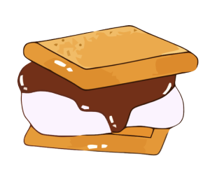

 

  

  <h3 align="center">smore</h3>

  

    Simple VM written in Go based on the LC-3 architecture.
  

 
 

## About

This is a virtual machine that emulates the [Little Computer 3 (LC-3)](https://en.wikipedia.org/wiki/Little_Computer_3). When done, it will feature the emulator, an assembler, and a disk imagin load and save system to write persistent programs and data across multiple sessions.
